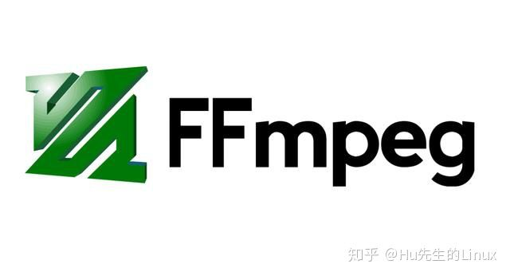
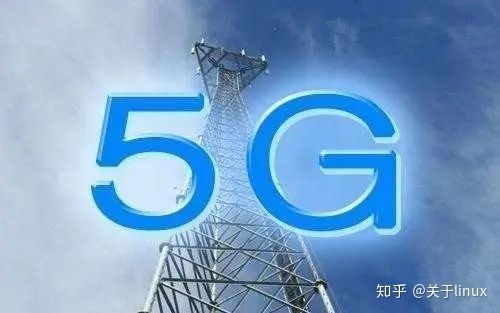
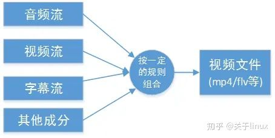
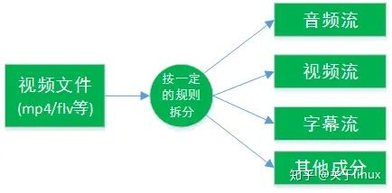
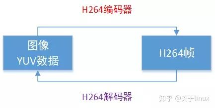
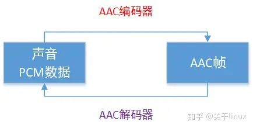
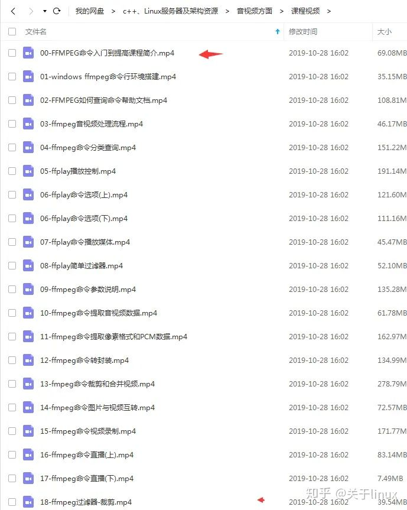

# 视频处理工具 FFmpeg 常用实例详解

> FFmpeg 是一个专业的多媒体框架，能够解码、编码、转码、复用、解复用、流式传输、过滤和播放几乎所有格式的媒体文件。 其核心就是 FFmpeg 程序本身，是一个基于**命令行**的视频和音频处理工具，多用于**视频转码**、**基础编辑**（修剪和合并）、**视频缩放**、**后期效果制作**等场景。 这里通过一些示例简单地介绍下 ffmpeg 命令的基本使用。





### 一、获取详细信息

ffmpeg -i <inputfile> -hide_banner 其中 -hide_banner 选项用于在输出文件的详细信息时省略 ffmpeg 的版本信息和编译选项等。

```text
$ ffmpeg -i bbb.mp4 -hide_banner
Input #0, mov,mp4,m4a,3gp,3g2,mj2, from 'bbb.mp4':
  Metadata:
    major_brand     : isom
    minor_version   : 1
    compatible_brands: isomavc1
    creation_time   : 2013-12-17T16:40:26.000000Z
    title           : Big Buck Bunny, Sunflower version
    artist          : Blender Foundation 2008, Janus Bager Kristensen 2013
    comment         : Creative Commons Attribution 3.0 - http://bbb3d.renderfarming.net
    genre           : Animation
    composer        : Sacha Goedegebure
  Duration: 00:10:34.53, start: 0.000000, bitrate: 8487 kb/s
    Stream #0:0(und): Video: h264 (High) (avc1 / 0x31637661), yuv420p, 3840x2160 [SAR 1:1 DAR 16:9], 8002 kb/s, 60 fps, 60 tbr, 60k tbn, 120 tbc (default)
    Metadata:
      creation_time   : 2013-12-17T16:40:26.000000Z
      handler_name    : GPAC ISO Video Handler
    Stream #0:1(und): Audio: mp3 (mp4a / 0x6134706D), 48000 Hz, stereo, fltp, 160 kb/s (default)
    Metadata:
      creation_time   : 2013-12-17T16:40:28.000000Z
      handler_name    : GPAC ISO Audio Handler
    Stream #0:2(und): Audio: ac3 (ac-3 / 0x332D6361), 48000 Hz, 5.1(side), fltp, 320 kb/s (default)
    Metadata:
      creation_time   : 2013-12-17T16:40:28.000000Z
      handler_name    : GPAC ISO Audio Handler
    Side data:
      audio service type: main
At least one output file must be specified
```

### 二、格式转换

ffmpeg -i <inputfile> <outputfile>

FFmpeg 是一个强大的音频和视频格式转换器，几乎支持当前所有常用的格式，如： $ ffmpeg -i input.avi output.mp4

或者经常需要用到的，将视频文件转为 **GIF 动图**： $ ffmpeg -i input.mp4 output.gif

如果在格式转换时需要保留源视频的质量，可以添加上 -qscale 0 选项（-qscale 的值越低，输出视频的质量越高）： $ ffmpeg -i input.webm -qscale 0 output.mp4

可以使用 -formats 选项列出 ffmpeg 命令支持的所有格式（很长很长的一个列表。。。）：

```text
$ ffmpeg -formats -hide_banner
File formats:
 D. = Demuxing supported
 .E = Muxing supported
 --
 D  3dostr          3DO STR
  E 3g2             3GP2 (3GPP2 file format)
  E 3gp             3GP (3GPP file format)
 D  4xm             4X Technologies
  E a64             a64 - video for Commodore 64
 D  aa              Audible AA format files
 D  aac             raw ADTS AAC (Advanced Audio Coding)
 DE ac3             raw AC-3
 D  acm             Interplay ACM
 D  act             ACT Voice file format
 D  adf             Artworx Data Format
 D  adp             ADP
 D  ads             Sony PS2 ADS
  E adts            ADTS AAC (Advanced Audio Coding)
 DE adx             CRI ADX
 D  aea             MD STUDIO audio
 D  afc             AFC
 DE aiff            Audio IFF
 D  aix             CRI AIX
 DE alaw            PCM A-law
 D  alias_pix       Alias/Wavefront PIX image
 DE amr             3GPP AMR
 D  amrnb           raw AMR-NB
 D  amrwb           raw AMR-WB
 D  anm             Deluxe Paint Animation
 D  apc             CRYO APC
 D  ape             Monkey's Audio
...
```

### 三、指定编码

可以通过 -c 选项手动指定输出文件的编码，如： $ ffmpeg -i input.mp4 -c:v vp9 -c:a libvorbis output.mkv 其中 -c:v 用于指定视频编码，-c:a 指定音频编码

**PS**：视频文件的后缀如 mp4、mkv、avi 等只是表示用来装载媒体流的**“容器”**类型，而编码时使用的编码方式则另需指定。 当然很多时候 ffmpeg 会根据输出文件的后缀自行选择默认的编码方式，无需手动指定。

### 只改变视频或者音频流的编码

可以在指定编码时，只改变视频或者音频编码中的一项，另一项则保持原来的格式： $ ffmpeg -i input.webm -c:v copy -c:a flac output.mkv -c:v copy 表示复制输入文件中的视频流到输出文件，不重新进行编码

### 只改变文件后缀

即输入文件中的视频流和音频流同时复制到输出文件，只改变文件后缀： $ ffmpeg -i input.webm -c:av copy output.mkv

### 编码列表

查看 FFmpeg 支持的所有音视频编码格式（又一个很长的列表。。。）：

```text
$ ffmpeg -codecs -hide_banner
Codecs:
 D..... = Decoding supported
 .E.... = Encoding supported
 ..V... = Video codec
 ..A... = Audio codec
 ..S... = Subtitle codec
 ...I.. = Intra frame-only codec
 ....L. = Lossy compression
 .....S = Lossless compression
 -------
 ...
 DEV.L. flv1                 FLV / Sorenson Spark / Sorenson H.263 (Flash Video) (decoders: flv ) (encoders: flv )
 D.V..S fmvc                 FM Screen Capture Codec
 D.VI.S fraps                Fraps
 D.VI.S frwu                 Forward Uncompressed
 D.V.L. g2m                  Go2Meeting
 D.V.L. gdv                  Gremlin Digital Video
 DEV..S gif                  GIF (Graphics Interchange Format)
 DEV.L. h261                 H.261
 DEV.L. h263                 H.263 / H.263-1996, H.263+ / H.263-1998 / H.263 version 2
 D.V.L. h263i                Intel H.263
 DEV.L. h263p                H.263+ / H.263-1998 / H.263 version 2
 DEV.LS h264                 H.264 / AVC / MPEG-4 AVC / MPEG-4 part 10 (decoders: h264 h264_qsv h264_cuvid ) (encoders: libx264 libx264rgb h264_amf h264_nvenc h264_qsv nvenc nvenc_h264 )
 DEVIL. hap                  Vidvox Hap
 DEV.L. hevc                 H.265 / HEVC (High Efficiency Video Coding) (decoders: hevc hevc_qsv hevc_cuvid ) (encoders: libx265 nvenc_hevc hevc_amf hevc_nvenc hevc_qsv )
...
```

### 四、视频压缩

### 编码与比特率

有些时候，基于磁盘空间和网络传输的考虑，需要对视频文件进行压缩处理。其中一种方法就是改变视频的**比特率**。 在某些情况下，比特率的适当缩减对视频的观看效果并不会产生太大的影响（人眼察觉的范围内）。 当然**编码的选择**也会对输出文件的大小产生一定的影响，示例如下：

$ ffmpeg -i input.webm -c:a copy -c:v vp9 -b:v 1M output.mkv -b:v 用于指定视频的比特率。

### 帧率

另一种方式就是改变视频文件的**帧率**，也就是人们常常提到的**FPS**。

$ ffmpeg -i input.webm -c:a copy -c:v vp9 -r 30 output.mkv -r 30 选项用于指定输出视频的帧率为 30 FPS。

### 分辨率

视频的分辨率也会影响文件的大小，可以使用 -s 选项指定输出文件的分辨率。当然，视频的画幅大小也会产生相应的变化：

$ ffmpeg -i input.mkv -c:a copy -s hd720 output.mkv 或 $ ffmpeg -i input.mkv -c:a copy -s 1280x720 output.mkv

### 五、提取音频

通过格式转换，FFmpeg 可以直接将视频文件转为音频文件，只需要指定输出文件的格式为 .mp3 或 .ogg 等。如： $ ffmpeg -i input.mp4 output.mp3

同时，也可以在转换时指定音频的格式选项： $ ffmpeg -i input.mp4 -vn -ar 44100 -ac 2 -ab 320 -f mp3 output.mp3

其中： -vn ：指定输出文件中禁用视频 -ar ：指定输出文件中音频的采样率 -ac：指定音频的通道数 -ab：指定音频的比特率 -f：指定输出文件的格式

### 六、常用实用命令集锦

### 调整分辨率

将某视频文件的分辨率改为 1280x720： $ ffmpeg -i input.mp4 -filter:v scale=1280:720 output.mp4 或者： $ ffmpeg -i input.mp4 -s 1280x720 output.mp4

### 压缩视频文件

$ ffmpeg -i input.mp4 -vf scale=1280:-1 -c:v libx264 -preset veryslow -crf 24 output.mp4

也可以添加如下选项同时对音频流进行压缩： -c:a aac -strict -2 -b:a 128k

### 移除音频

$ ffmpeg -i input.mp4 -an output.mp4 -an 选项表示在输出文件中禁用音频

### 提取图片

$ ffmpeg -i input.mp4 -r 1 -f image2 image-%2d.png

其中各选项的含义： -r ：设置帧率，即每秒有多少帧画面被提取到图片中。默认为 25 -f ：指定输出的格式。本例中为图片（image2） -image-%2d.png ：指定提取出的图片的命名方式。本例中最终的命名为 image-01.png、image-02.png 等。如使用 image-%3d.png ，则最终的命名为 image-001.png、imag-002.png 等

### 裁剪视频

即截取指定范围内的**视频画面**，裁切掉多余的部分： $ ffmpeg -i input.mp4 -vf "crop=w:h:x:y" output.mp4

其中 crop=w:h:x:y 用于指定“裁剪框”的大小和位置。 w 表示裁剪部分的宽度（默认为源视频的宽度 iw）； h 表示裁剪部分的高度（默认为源视频的高度 ih； x 表示 x 轴上裁剪的起始位置（最左边为 0，默认为源视频的中间位置）； y 表示 y 轴上裁剪的起始位置（最顶部为 0，默认为源视频的中间位置）。

### 改变视频比例

视频比例即视频画幅的长宽比，也就是通常所说的 4:3 和 16:9 等。 $ ffmpeg -i input.mp4 -aspect 16:9 output.mp4

### 设置音频封面

即创建以一张静止的图片为画面的视频。

$ ffmpeg -loop 1 -i inputimage.jpg -i inputaudio.wav -c:v libx264 -tune stillimage -c:a aac -b:a 192k -shortest output.mp4 其中的选项和参数可以根据需求自行修改和省略。

### 截取视频片段

$ ffmpeg -i input.mp4 -ss 00:00:50 -codec copy -t 60 output.mp4 截取视频中从第 50 秒开始，持续时间为一分钟的视频片段。

其中 -ss 用于指定视频片段的开始时间； -t 指定视频片段的持续时间，单位都为秒。

也可以使用如下方式： $ ffmpeg -i audio.mp3 -ss 00:01:54 -to 00:06:53 -c copy output.mp3

以上命令也适用于音频文件。

### 视频分割

$ ffmpeg -i input.mp4 -t 00:00:30 -c copy part1.mp4 -ss 00:00:30 -codec copy part2.mp4 将输入的视频文件分割为两段，第一段为从最开始到第 30 秒；第二段为第 30 秒到视频结束。 其中 -t 00:00:30 前面省略了 -ss 00:00:00； -ss 00:00:30 后面省略了 -t 剩余时间。

有点类似于截取多个连续的视频片段。

### 视频合并

首先创建包含各媒体文件路径列表的文本文件 join.txt ：

```text
file '~/myvideos/part1.mp4'
file '~/myvideos/part2.mp4'
file '~/myvideos/part3.mp4'
```

使用 -f concat 选项对多个视频进行合并： $ ffmpeg -f concat -i join.txt -c copy output.mp4

### 添加字幕文件

$ ffmpeg -i input.mp4 -i subtitle.srt -map 0 -map 1 -c copy -c:v libx264 -crf 23 -preset veryfast output.mp4

### 改变视频播放速度（音频不受影响）

$ ffmpeg -i input.mp4 -vf "setpts=0.5*PTS" output.mp4

上述命令会加快视频画面的播放速度，音频播放速度不变。

如果想放慢视频画面的切换速度，可以相应地将 setpts=0.5*PTS 中的 0.5 改为大于 1 的数值。

### Padding

即宽银幕视频中上下的两道“黑边”，可以使用 FFmpeg 命令添加类似的效果： $ ffmpeg -i input.mp4 -vf "scale=1920:1080:force_original_aspect_ratio=decrease,pad=1920:1080:(ow-iw)/2:(oh-ih)/2:black" output.mp4

该效果由 -vf 选项的 pad 参数指定，可以根据情况自行修改。

### 从图片创建视频

$ ffmpeg -framerate 1 -i img%02d.jpg -c:v libx264 -r 30 -pix_fmt yuv420p output.mp4 把当前目录下的多张图片（名字为 img01.jpg、img02.jpg 的形式）组合为一个视频文件，效果类似于自动播放的 PPT。 **每秒切换一张图片**。

$ ffmpeg -framerate 30 -i img%02d.jpg -c:v libx264 -pix_fmt yuv420p output.mp4 也是将当前目录下的多张图片组合成一个完整的视频，该视频帧率为 30 FPS。 **每帧切换一张图片**。

### **需要更多音视频、webrtc、ffmpeg视频学习资料 文档请加群720209036获取**


# 音视频开发 FFmpeg 介绍与基础知识理解

[](https://www.zhihu.com/people/yi-qi-wu-7)

[关于linux](https://www.zhihu.com/people/yi-qi-wu-7)

Linux服务后台架构视频资源群:784033627

15 人赞同了该文章

## 前言：

## 5G 时代来了，底层开发，音视频开发又是一个市场趋势。




## FFmpeg简介 

FFmpeg的名称来自MPEG视频编码标准，前面的“FF”代表“Fast

Forward”，FFmpeg是一套可以用来记录、转换数字音频、视频，并能将其转化为流的开源计算机程序。可以轻易地实现多种视频格式之间的相互转换

FFmpeg的用户有Google，Facebook，Youtube，优酷，爱奇艺，土豆等

## 基础知识 

**容器/文件(Conainer/File)：**即特定格式的多媒体文件，比如mp4、flv、mkv等。

**媒体流（Stream）：**表示时间轴上的一段连续数据，如一段声音数据、一段视频数据或一段字幕数据，可以是压缩的，也可以是非压缩的，压缩的数据需要关联特定的编解码器。

**数据帧/数据包(Frame/Packet)：**通常，一个媒体流是由大量的数据帧组成的，对于压缩数据，帧对应着编解码器的最小处理单元，分属于不同媒体流的数据帧交错存储于容器之中。

一般情况下：

Frame对应压缩前的数据，Packet对应压缩后的数据。

**编解码器(Codec)：**以帧为单位实现压缩数据和原始数据之间的相互转换的

**复用(mux)：**把不同的流按照某种容器的规则放入容器，这种行为叫做复用（mux）

**解复用(mux)：**把不同的流从某种容器中解析出来，这种行为叫做解复用(demux)

## 基础知识-解复用器

**复用(mux)：**把不同的流按照某种容器的规则放入容器，这种行为叫做复用（mux）

复用器muxer比如MP4/FLV




**解复用(mux)：**把不同的流从某种容器中解析出来，这种行为叫做解复用(demux)

解复用器demuxerMP4/FLV




## 基础知识-编解码器codec

**编解码器(Codec)：**以帧为单位实现压缩数据和原始数据之间的相互转换的

**视频编解码器**



**音频编解码器**



基础知识-码率和帧率

**码率和帧率**是视频文件的最重要的基本特征，对于他们的特有设置会决定视频质量。如果我们知道码率和时长那么可以很容易计算出输出文件的大小。

**帧率：**帧率也叫帧频率，帧率是视频文件中每一秒的帧数，肉眼想看到连续移动图像至少需要15帧。

**码率：**比特率(也叫码率，数据率)是一个确定整体视频/音频质量的参数，秒为单位处理的位数，码率和视频质量成正比，在视频文件中中比特率用bps来表达。

附：音视频入门到提高技术教程



**教程主要涉及知识点：**
1.FFmpeg的转码流程是什么？

2.常见的视频格式包含哪些内容吗？

3.如何把这些内容从视频文件中抽取出来？

4.如何从一种格式转换为另一种格式？

5.如何放大和缩小视频？

6.如何旋转，翻转，填充，裁剪，模糊，锐化视频？

7.如何给视频加logo，删除logo？

8.如何给视频加文本，动态文本？

9.如何处理图片？

10.如何录像，添加动态logo，截图，马赛克视频？

需要教程学习可加我群

总结：在IT行业，只有不断学才能跟上时代，5g来了，音视频这个趋势希望你能抓住。


# 视频通信中音视频处理技术

视频通信过程中会涉及到大量的音视频处理技术，按照在通信系统中所处位置的不同，可以分为发送端和接收端的音视频处理技术。


发送端的音视频处理技术主要包括：视频帧的变换、自适应丢帧、增强；音频采样率转换、回声消除；音视频修饰等。这些技术的目的都是为视频直播提供高质量或者定制化的信号源。


## **对于发送端视频的处理**

**
**


**一、视频帧的变换**


采集到的视频源首先需要进行裁剪，缩放，自适应丢帧，颜色空间转换等变换，这些作为视频处理的预处理，可以为后续操作带来速度和性能的提升。


**裁剪：**将帧数据裁剪或填充到4字节的整数倍，便于后续可以进行位移操作或者汇编优化；

**缩放：**现在手机或电脑的摄像头提供的输入视频分辨率在2K左右，如果不加缩放的提供给后续的图像处理和编码，对设备处理能力和网络传输带宽的要求会很高（2K视频一般需要4Mbps的带宽支持，才能保证基本的清晰度），尤其是对延迟很敏感的视频通信应用。所以系统实现应根据设备性能和当前网络状态，对输入视频进行缩放，以此来保证通信的低延迟和流畅。比如，我们的AI米听会检测CPU性能，再根据目标码率，计算得到一个合适的缩放比例，对视频进行预处理。缩放一般采用汇编实现，也可以借助ffmpeg中swscale工具集。


**二、自适应丢帧**


这个处理技术的目的和缩放类似，也是为了更好的**适应设备的处理性能和网络状态**。但是视频通信内容的不同，应该选择不同的处理方式。

比如，对于**人像通信，适合采用缩放的方式**；而对于**屏幕分享，适合降低帧率**。如果采用相反的技术，效果会很差。这是因为人脸大部分是低频的内容，缩放不会对人的主观视频产生明显影响，而降低帧率则会产生明显的不连续性且容易被人察觉；相反，屏幕展示内容中，包含大量的高频信息（文字，图表），如果采用降采样，则会损失大量高频信息，从而使得内容难以辨认。屏幕分享时，往往是内容的静止展示，所以此时降低帧率不会明显影响观看感受。


**三、视频增强**


**对于摄像头质量不佳，或者低照明度的通信环境，采集到的视频帧噪声大，质量低下，这是需要对视频内容进行增强**。常用的技术包括图像去噪，对比度调整，曝光度调整等。图像去噪包括经典的高斯滤波，中值滤波，Non-local mean滤波等；对比度和曝光度的调整可以基于直方图来做。


**四、颜色空间转换**

我们熟知的颜色空间是**RGB空间**，但是在视频处理和编码中往往要**转换成YUV**，其中Y是亮度通道，UV是两个色度通道。我们人眼对亮度的细节比色度更加敏感，根据这个特性，我们可以只对亮度通道进行处理以降低处理复杂度。编码时，保持色度通道不变而将色度通道降采样（比如RGB转换成YUV420，就是从一个像素3个字节变成了一个像素1.5个字节，原始数据量减少了一半），可以减小码率，同时又不会对人眼主观视频产生明显影响。


## **对于发送端音频的处理**

**
**

对于发送端音频处理主要包括：转换采样率，去噪和回音消除。


**转换采样率：**和视频缩放和降采样一样的道理，音频可以根据设备性能和带宽需求改变采样率，来更好的适应通信环境。


**去噪：**如果通信方身处嘈杂的环境，那么采集到的音频会包含大量的噪声。此时可以设计合适的滤波器对波形进行滤波操作，以保留人声，去除环境噪声。


**回音消除：**在双向通信中，播放对方音频播放时，直接从麦克风又传给了对方，会带来回音。音频回音的影响很大，如果不加以抑制，严重时会有啸叫现象，产生刺耳且长时间保持的噪声。回音消除的原理简单可以描述为：B收到A的声音数据，通过喇叭进行播放，此时B需要对输入到麦克风中的声音进行处理，识别A的声音并去除。


音频处理涉及到大量信号处理的理论，好在很多开源库都提供了音频处理的功能，比如ffmpeg，speedx， webrtc等。


## **接收端的音视频处理**


接收端的音视频处理技术主要是为了**恢复出原始音视频信号**，这里包括的技术有：视频增强，超分辨；音频去噪和混音。


**视频增强：**在接受端，解码得到的视频会有压缩失真，比如块效应，振铃效应等，所以也需要进行去噪等操作，提高视频质量。


**视频超分辨：**在发送端，会将视频缩小后进行处理和编码。那么在接收端，则需要进行放大，提高视频分辨率，提升主观感受。


**音频去噪：**和视频一样，音频也会受到编码影响，所以也需要进行去噪。


**混音：**在多人视频中，会接受到来自多方的音频信息。此时需要对各路音频进行混音，混合成一路送进扬声器进行播放。这个过程中，一般要先对波形数据进行同步，然后对波形进行叠加，为了防止破音出现，最后还要进行自动增益控制和防溢出操作。


## **其他功能**

**
**


近年来，随着音视频通信技术的兴起，也出了很多新的玩法，比如视频美颜、表情迁移和变声等。


**视频美颜：**现在已经趋于成熟。主要功能是**磨皮，柔光等，大都基于滤波进行操作**，比如磨皮采用了双边滤波，可以在保持了人脸轮廓边缘的同时，将皮肤的瑕疵去除。


**表情迁移：**基于深度学习的特征学习技术，可以快速准确的对人脸器官进行定位，从而能够实现更复杂的修饰技术。比如找准嘴唇，眼睛，面颊之后，可以进行自动化妆；根据关键点和人脸角度，进行人脸映射，达到“换脸”的效果。


**音频变声技术：**一款比较经典的技术，可以通过改变声音波形的频率，振幅来改变音色，达到伪装声音的目的。而现在已经发展到可以让人模拟别人的声音的地步。


## **总结**

**
**

音视频通信处理技术在实际的使用中，还是要针对不同的场景选择不同的技术。只有这样才能达到最佳的效果。