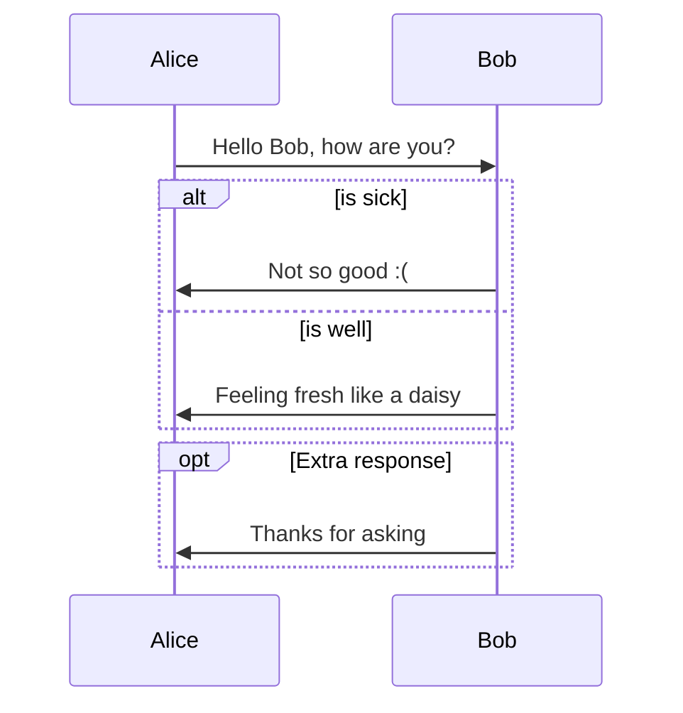
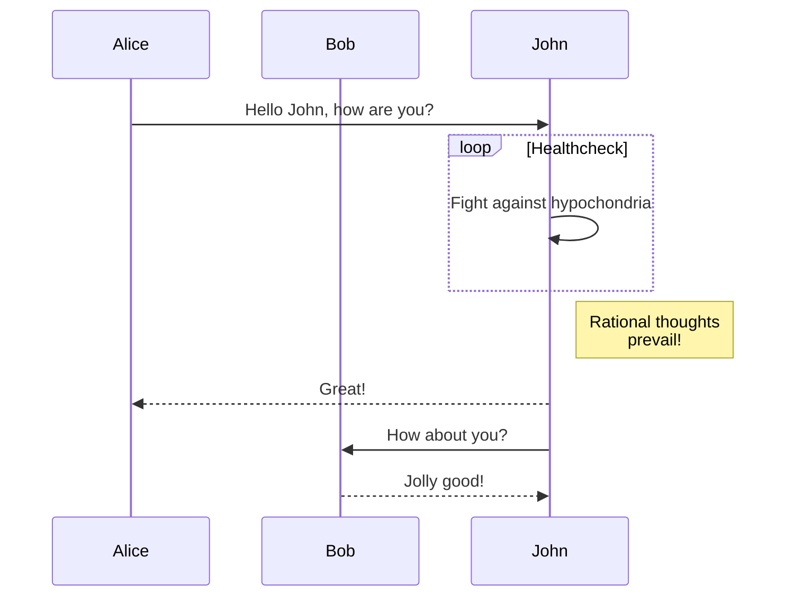
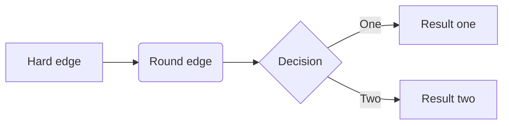
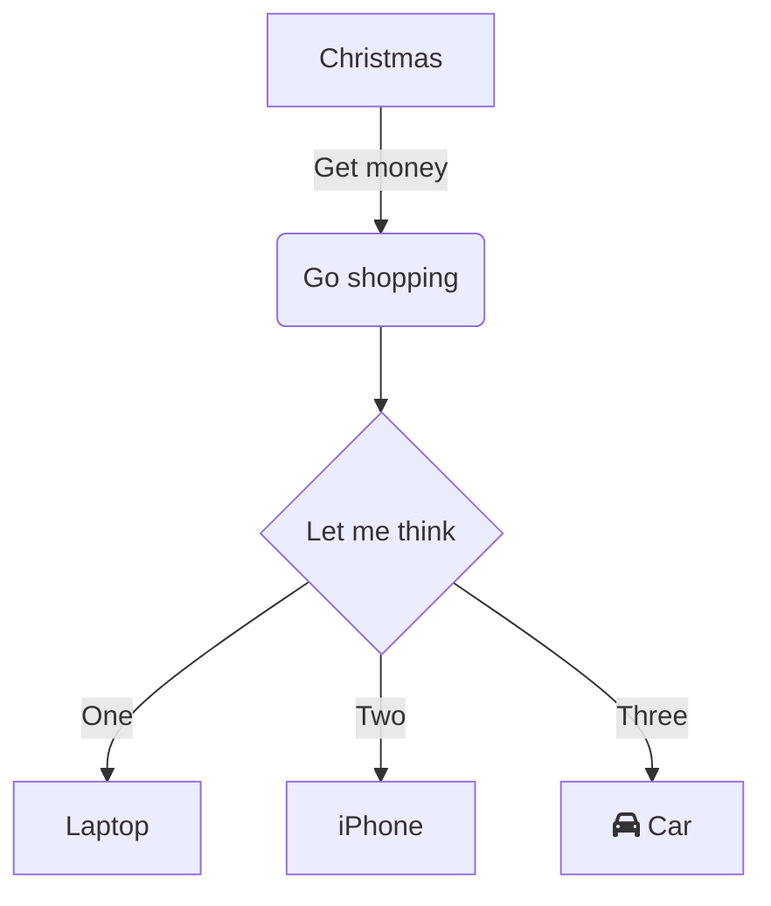
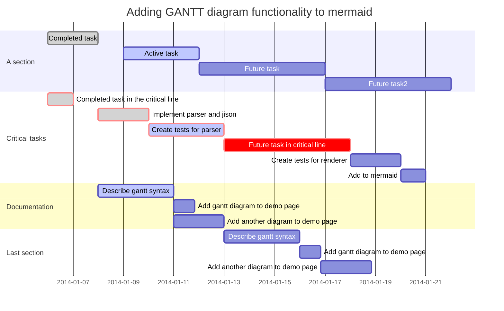
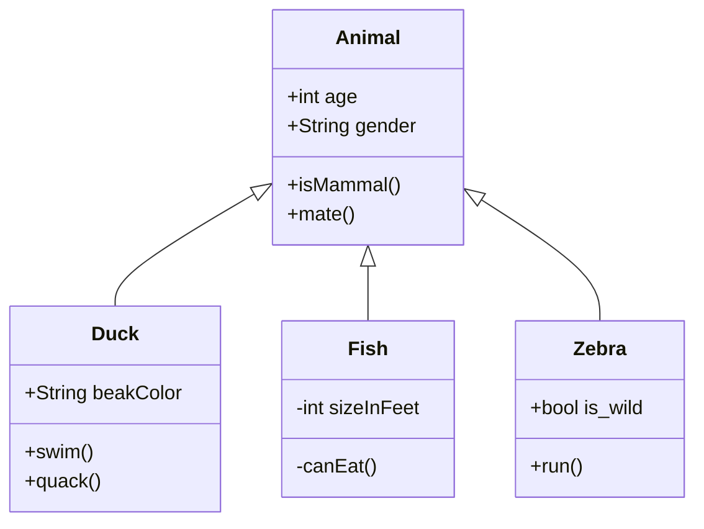
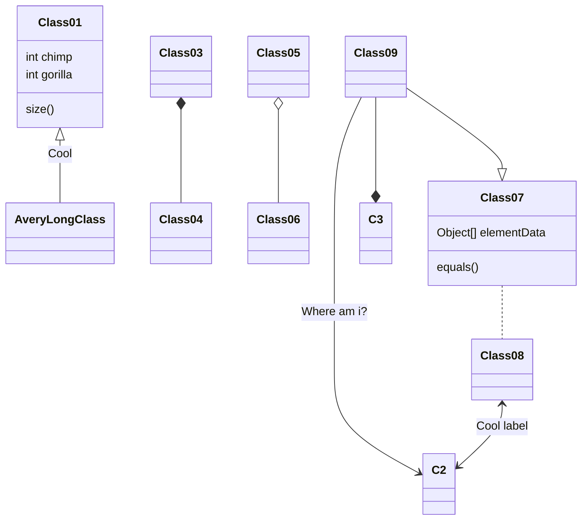
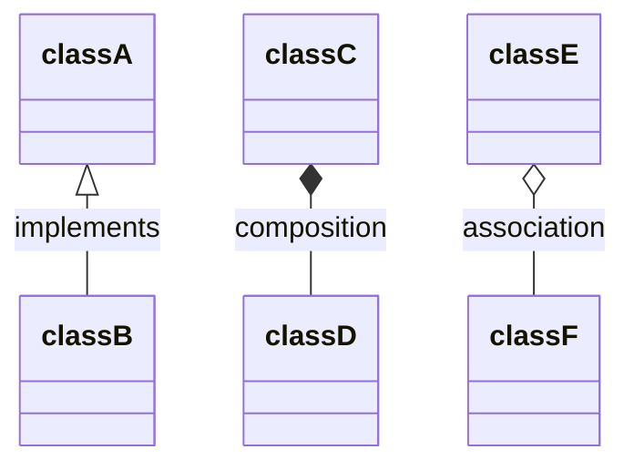
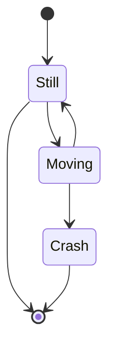
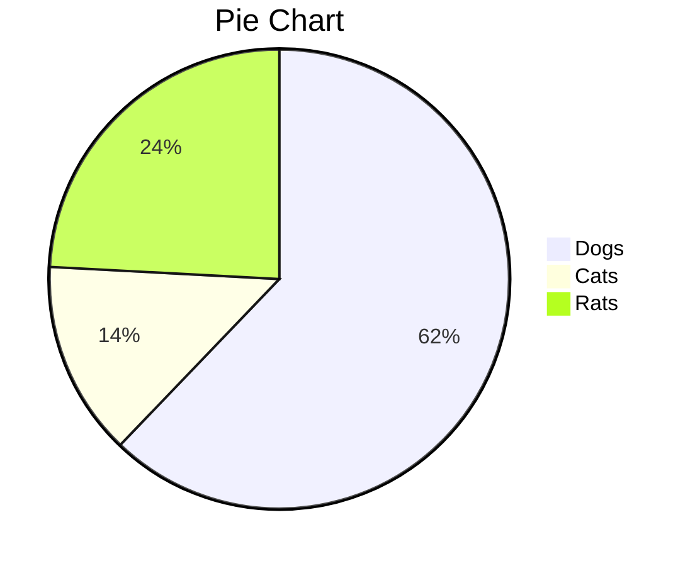

画图

https://support.typora.io/Draw-Diagrams-With-Markdown/

https://mermaid-js.github.io/mermaid/#/

### Sequence

```sequence
Alice->Bob: Hello Bob, how are you?
Note right of Bob: Bob thinks
Bob-->Alice: I am good thanks!
```


### Flowchart

```flow
st=>start: Start
op=>operation: Your Operation
cond=>condition: Yes or No?
e=>end

st->op->cond
cond(yes)->e
cond(no)->op
```


### Mermaid: Sequence






### Mermaid: Flowchart







### Mermaid: Gantt




### Mermaid: Class Diagram








### Mermaid: State Diagram



### Mermaid: Pie Chart



