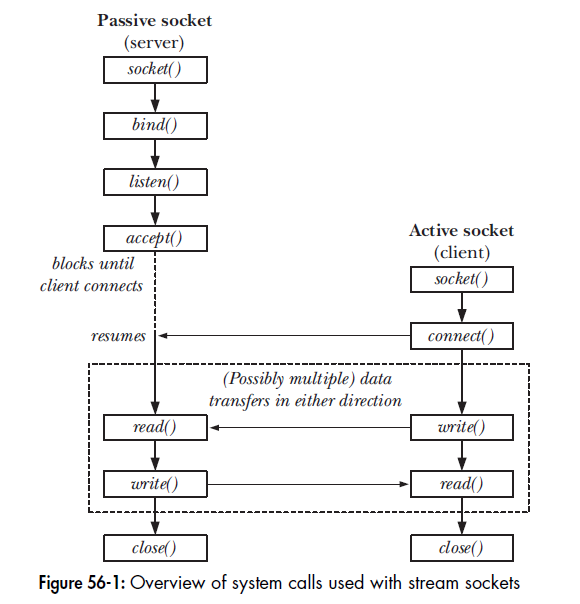
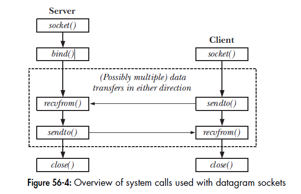

56.SOCKET：介绍

**56.1 概述**

socket存在于一个通信的domain中，它确定：

a. 识别出一个socket的方法（即socket地址的格式）

b. 通信范围（即是在位于同一主机上应用程序之间进行通信，还是位于使用网络连接起来的不同主机上的应用程序之间）

支持的domain如下：

UNIX(AF_UNIX)：内核中通信，地址格式为路径名，地址结构为sockaddr_un

IPv4(AF_INET)：地址结构为sockaddr_in

IPv6(AF_INET6)：地址结构为sockaddr_in6

**56.2 创建一个socket：socket()**

\#include <sys/socket.h>

int socket(int domain, int type, int protocol);

成功返回文件描述符

参数type：SOCK_STREAM、SOCK_DGRAM

参数protocol：传0即可

题外话：AF(address family，地址族)

**56.3 将socket绑定到地址：bind()**

\#include <sys/socket.h>

int bind(int sockfd, const struct sockaddr *addr, socklen_t addrlen);

参数addr：指向了一个指定该socket绑定到的地址的结构

参数addrlen：地址结构的大小

**56.4 通用socket地址结构：struct sockaddr**

struct sockaddr {

  sa_family_t  sa_family;  --地址族（AF_）

  char sa_data[14];  --地址

};

**56.5 流socket**

**56.5.1 监听接入连接：listen()**

\#include <sys/socket.h>

int listen(int sockfd, int backlog);

参数backlog的作用：有可能客户端在服务器调用accept()之前调用connect()，将产生一个未决的连接，backlog参数限制这种未决连接的数量，限制之内的会被处理，之外的被阻塞。

**56.5.2 接受连接：accept()**

\#include <sys/socket.h>

int accept(int sockfd, struct sockaddr *addr, socklen_t *addrlen);

参数addr：指向一个用来返回对端socket地址的结构

参数addrlen：在调用被执行之前必须要将这个整数初始化为addr指向的缓冲区大小，这样内核就知道有多少空间可用于返回socket地址了；当accept()返回之后，这个整数被设置成实际初复制进缓冲区中的数据的字节数。

返回结果是已连接的文件描述符。

**56.5.3 连接到对等socket：connect()**

\#include <sys/socket.h>

int connect(int sockfd, const struct sockaddr *addr, socklen_t addrlen);

**56.5.4 流socket I/O**

SIGPIPE信号

EPIPE错误

**56.5.5 连接终止：close()**

**56.6 数据报socket**

数据报socket的动作类似于邮政系统

**56.6.1 交换数据报：recvfrom和sendto()**

\#include <sys/socket.h>
ssize_t recvfrom(int sockfd, void *buffer, size_t length, int flags, struct sockaddr *src_addr, socklen_t *addrlen);

ssize_t sendto(int sockfd, const void *buffer, size_t length, int flags, const struct sockaddr *dest_addr, socklen_t addrlen);

参数src_addr与addrlen会返回用来发送数据报的远程socket的地址（类型于accept中的addr和addrlen参数）

参数dest_addr与addrlen指定了数据报发送到的socket(使用方式与connect()中的相应参数一样)

56.6.2  在数据报socket上使用connect()